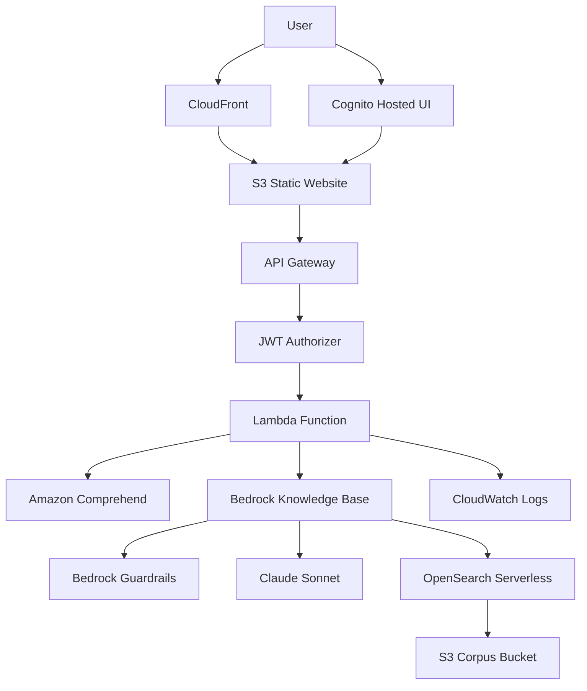
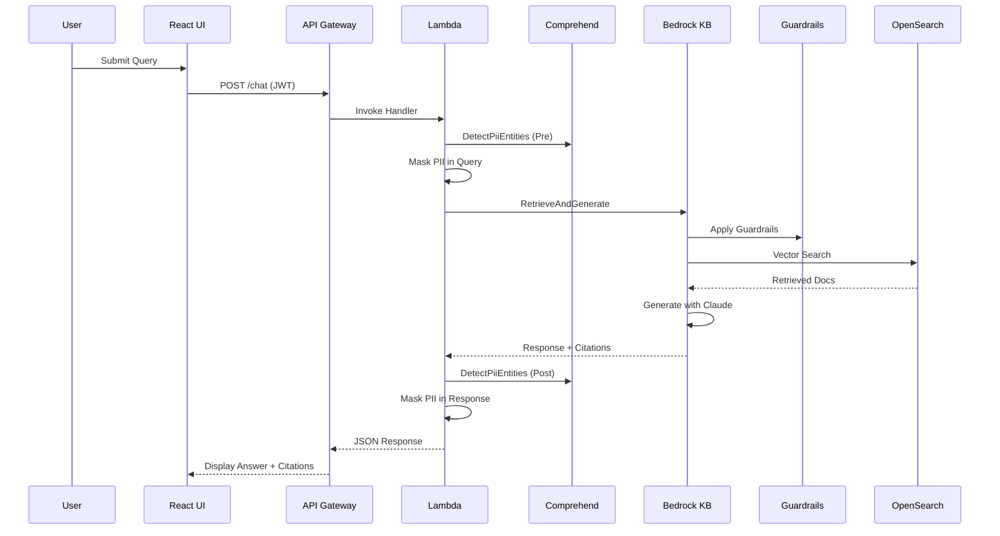

# Design Document

## Overview

FedRag is a privacy-first RAG assistant that implements a secure, multi-layered architecture on AWS. The system follows a serverless microservices pattern with React frontend, Lambda backend, and managed AWS services for AI/ML capabilities. The design prioritizes security through multiple PII protection layers, authentication via Cognito, and infrastructure as code via Terraform.

## Architecture

### High-Level Architecture



### Data Flow



## Components and Interfaces

### Frontend Components (React + TypeScript)

#### Core Components
- **App.tsx**: Main application router with authentication state management
- **Chat.tsx**: Primary chat interface with message history and input handling
- **Message.tsx**: Individual message rendering with PII toggle functionality
- **Citations.tsx**: Citation panel displaying source documents with links and excerpts

#### Authentication Module
- **cognito.ts**: Cognito integration utilities
  - `login()`: Redirect to Hosted UI with PKCE flow
  - `handleCallback()`: Exchange authorization code for tokens
  - `logout()`: Clear tokens and redirect to logout URL
  - `getToken()`: Retrieve valid JWT from localStorage
  - `isAuthenticated()`: Check token validity

#### API Client Module
- **client.ts**: HTTP client with JWT integration
  - `apiCall()`: Wrapper for fetch with automatic JWT header injection
  - `chatQuery()`: Specific endpoint for chat queries
  - Error handling for 401/403 responses with re-authentication

### Backend Components (Lambda + TypeScript)

#### Core Handler
- **index.ts**: Main Lambda handler
  - Request validation and parsing
  - Orchestration of PII → KB → PII flow
  - Structured logging with correlation IDs
  - Error handling and response formatting

#### Bedrock Integration
- **bedrock.ts**: Knowledge Base and Guardrails integration
  - `askKb()`: RetrieveAndGenerate API calls with configuration
  - Guardrail configuration attachment
  - Citation processing and formatting
  - Session management for conversation continuity

#### PII Protection
- **pii.ts**: Comprehensive PII detection and masking
  - `redactPII()`: Comprehend DetectPiiEntities integration
  - Span-based masking with offset handling
  - Support for overlapping entity detection
  - Configurable masking patterns

#### Type Definitions
- **types.ts**: Shared TypeScript interfaces
  - API request/response schemas
  - Bedrock service response types
  - Citation and guardrail action types
  - Configuration interfaces

### Infrastructure Components (Terraform)

#### Knowledge Base Infrastructure
- **kb.tf**: Complete RAG infrastructure
  - S3 corpus bucket with versioning and encryption
  - OpenSearch Serverless VECTOR collection via aws-ia module
  - Bedrock Knowledge Base with Titan embeddings configuration
  - IAM roles and policies for service integration

#### Security and Guardrails
- **guardrails.tf**: Bedrock Guardrails configuration
  - Harm category filters (HATE, VIOLENCE, SELF_HARM) at HIGH threshold
  - PII entity detection with MASK action
  - Denied topics configuration for compliance
  - Custom blocked input/output messaging

#### API Infrastructure
- **api.tf**: Serverless API stack
  - Lambda function with Node.js 20 runtime
  - API Gateway HTTP API with CORS configuration
  - JWT authorizer integration with Cognito
  - IAM roles with least-privilege permissions

#### Authentication
- **auth.tf**: Cognito configuration
  - User pool with security policies
  - App client for OAuth code flow (no client secret)
  - Hosted UI domain configuration
  - Callback and logout URL configuration

#### Frontend Hosting
- **hosting.tf**: Static website infrastructure
  - S3 bucket with static website configuration
  - CloudFront distribution with OAC
  - Cache policies optimized for SPA
  - Custom domain support (optional)

## Data Models

### API Request/Response Models

```typescript
// Chat API Request
interface ChatRequest {
  query: string;
  sessionId?: string;
}

// Chat API Response
interface ChatResponse {
  answer: string;
  citations: Citation[];
  guardrailAction?: 'INTERVENED' | 'NONE';
  sessionId: string;
  redactedQuery?: string;
  redactedAnswer?: string;
}

// Citation Model
interface Citation {
  generatedResponsePart: {
    textResponsePart: {
      text: string;
      span: { start: number; end: number };
    };
  };
  retrievedReferences: Array<{
    content: { text: string };
    location: { s3Location?: { uri: string } };
    metadata?: Record<string, any>;
  }>;
}
```

### Bedrock Knowledge Base Configuration

```typescript
interface KnowledgeBaseConfig {
  knowledgeBaseId: string;
  modelArn: string; // anthropic.claude-3-5-sonnet-20240620-v1:0
  generationConfiguration: {
    guardrailConfiguration: {
      guardrailId: string;
      guardrailVersion: string;
    };
    inferenceConfig: {
      textInferenceConfig: {
        temperature: 0.2;
        topP: 0.9;
        maxTokens: 800;
      };
    };
    promptTemplate: {
      textPromptTemplate: string; // Enforce citations and context-only responses
    };
  };
  retrievalConfiguration: {
    vectorSearchConfiguration: {
      numberOfResults: 6;
    };
  };
}
```

### PII Entity Model

```typescript
interface PiiEntity {
  Type: string; // EMAIL, PHONE, SSN, etc.
  Score: number;
  BeginOffset: number;
  EndOffset: number;
}

interface PiiMaskingResult {
  originalText: string;
  maskedText: string;
  entitiesFound: PiiEntity[];
}
```

## Error Handling

### Frontend Error Handling
- **Authentication Errors**: Automatic redirect to Cognito login
- **API Errors**: User-friendly error messages with retry options
- **Network Errors**: Offline detection and retry mechanisms
- **Validation Errors**: Real-time input validation with feedback

### Backend Error Handling
- **AWS Service Errors**: Exponential backoff with jitter for retries
- **Guardrail Interventions**: Graceful handling with appropriate user messaging
- **PII Detection Failures**: Fallback to conservative masking strategies
- **Knowledge Base Errors**: Fallback responses when retrieval fails

### Infrastructure Error Handling
- **Terraform State Management**: Remote state with locking (future enhancement)
- **Resource Creation Failures**: Proper dependency management and rollback
- **IAM Permission Issues**: Comprehensive permission validation
- **Service Limit Handling**: Graceful degradation and alerting

## Testing Strategy

### Unit Testing (Backend)
- **PII Masking Tests**: 
  - Overlapping entity spans
  - Edge cases with special characters
  - Performance with large text blocks
  - Accuracy of offset calculations

- **Knowledge Base Integration Tests**:
  - Mock Bedrock responses for consistent testing
  - Citation parsing and formatting
  - Guardrail action handling
  - Session management validation

- **Guardrail Tests**:
  - Simulate denied topics and verify interventions
  - Test custom blocked message responses
  - Validate PII masking integration
  - Performance impact measurement

### Integration Testing (Frontend)
- **Authentication Flow Tests**:
  - Complete OAuth code flow simulation
  - Token refresh and expiration handling
  - Logout and cleanup verification

- **API Integration Tests**:
  - End-to-end chat functionality
  - Citation rendering and linking
  - PII toggle functionality
  - Error state handling

### Infrastructure Testing
- **Terraform Validation**:
  - Plan validation in CI/CD
  - Resource dependency verification
  - Security policy validation
  - Cost estimation integration

### Performance Testing
- **Load Testing**: API Gateway and Lambda scaling behavior
- **Latency Testing**: End-to-end response time measurement
- **Cost Optimization**: AWS service usage monitoring and optimization

## Security Considerations

### Multi-Layer PII Protection
1. **Pre-processing**: Comprehend PII detection before Bedrock
2. **Guardrails**: Bedrock native PII masking during generation
3. **Post-processing**: Additional Comprehend scan of responses
4. **Client-side**: Optional redaction display toggle

### Authentication and Authorization
- **JWT Validation**: API Gateway native JWT authorizer
- **Token Security**: Secure storage and automatic refresh
- **Session Management**: Proper logout and token cleanup
- **CORS Configuration**: Restrictive origin policies

### Infrastructure Security
- **Encryption**: At-rest and in-transit encryption for all data
- **Network Security**: VPC endpoints and security groups (future enhancement)
- **IAM Policies**: Least-privilege access with resource-specific permissions
- **Audit Logging**: Comprehensive CloudWatch logging with retention policies

### Compliance Features
- **Data Residency**: us-east-1 region constraint
- **Audit Trail**: Structured logging for compliance reporting
- **PII Handling**: Comprehensive masking with configurable patterns
- **Access Controls**: Role-based access through Cognito groups (future enhancement)

## Deployment and Operations

### CI/CD Pipeline
- **Pull Request Workflow**: Lint, test, and Terraform plan
- **Main Branch Workflow**: Manual approval gate for Terraform apply
- **Rollback Strategy**: Terraform state management and version control
- **Environment Promotion**: Dev → Staging → Production pipeline (future)

### Monitoring and Observability
- **CloudWatch Metrics**: Custom metrics for PII detection, guardrail interventions
- **Structured Logging**: JSON logs with correlation IDs and performance metrics
- **Alerting**: CloudWatch alarms for error rates and latency thresholds
- **Cost Monitoring**: AWS Cost Explorer integration and budget alerts

### Operational Procedures
- **Corpus Management**: Scripts for document upload and knowledge base sync
- **Model Updates**: Procedures for updating Bedrock models and configurations
- **Security Updates**: Regular review and update of guardrail policies
- **Performance Tuning**: Lambda memory and timeout optimization based on metrics